# Smart Fridge AI System - Workflow Diagram

```mermaid
flowchart TB
    %% Input Layer
    subgraph Input["🎥 INPUT SOURCES"]
        A1[Fridge Camera]
        A2[Manual Entry]
        A3[Barcode Scanner]
    end

    %% Computer Vision Layer
    subgraph CV["🔍 COMPUTER VISION MODULE"]
        B1[YOLOv8 Food Detection]
        B2[OCR Text Extraction]
        B3[Barcode Recognition]
    end

    %% Data Extraction Layer
    subgraph Extract["📊 DATA EXTRACTION"]
        C1[Food Item Identification]
        C2[Expiry Date Extraction]
        C3[Category Classification]
        C4[Quantity Detection]
    end

    %% Database Layer
    subgraph DB["💾 DATABASE STORAGE"]
        D1[(Food Items Table)]
        D2[(Alerts Table)]
        D3[(Consumption History)]
        D4[(Recipes Table)]
    end

    %% Core Processing Layer
    subgraph Process["⚙️ CORE PROCESSING"]
        E1[Expiry Tracker<br/>• Monitor Shelf Life<br/>• Calculate Days Remaining<br/>• Status Classification]
        E2[Alert Generator<br/>• Critical Alerts<br/>• Warning Alerts<br/>• Normal Alerts]
        E3[Recipe Generator<br/>• AI-Powered GPT<br/>• Use Expiring Items<br/>• Dietary Preferences]
    end

    %% Output Layer
    subgraph Output["📱 USER INTERFACE"]
        F1[Web Dashboard<br/>Streamlit]
        F2[Alert Notifications<br/>Desktop/Email/SMS]
        F3[Recipe Display<br/>& Suggestions]
    end

    %% User Actions Layer
    subgraph Actions["👤 USER ACTIONS"]
        G1[View Inventory]
        G2[Add/Remove Items]
        G3[Generate Recipe]
        G4[Mark as Consumed]
        G5[Acknowledge Alerts]
    end

    %% Connections
    A1 --> B1
    A1 --> B2
    A3 --> B3
    A2 --> C1

    B1 --> C1
    B2 --> C2
    B3 --> C1
    B1 --> C3
    B1 --> C4

    C1 --> D1
    C2 --> D1
    C3 --> D1
    C4 --> D1

    D1 <--> E1
    D1 <--> E2
    D1 <--> E3

    E1 --> E2
    E2 --> D2
    E1 --> E3

    D1 --> F1
    D2 --> F2
    D4 --> F3
    E3 --> F3

    F1 <--> G1
    F1 <--> G2
    F3 <--> G3
    F2 <--> G5
    G4 --> D3

    G2 --> D1
    G3 --> E3
    G4 --> D1
    G5 --> D2

    %% Styling
    classDef inputStyle fill:#E3F2FD,stroke:#1976D2,stroke-width:2px
    classDef processStyle fill:#FFF3E0,stroke:#F57C00,stroke-width:2px
    classDef dbStyle fill:#E8F5E9,stroke:#388E3C,stroke-width:2px
    classDef outputStyle fill:#F3E5F5,stroke:#7B1FA2,stroke-width:2px
    classDef alertStyle fill:#FFEBEE,stroke:#C62828,stroke-width:2px

    class A1,A2,A3 inputStyle
    class B1,B2,B3,C1,C2,C3,C4,E1,E3 processStyle
    class D1,D2,D3,D4 dbStyle
    class F1,F3 outputStyle
    class E2,F2 alertStyle
```

## System Data Flow

### Phase 1: Input & Detection
1. **Image Capture**: Fridge camera captures images of stored food
2. **Computer Vision**: YOLOv8 detects food items with bounding boxes
3. **OCR Processing**: Extracts text from labels for expiry dates
4. **Barcode Scanning**: Identifies products via barcode (optional)

### Phase 2: Data Processing
1. **Food Identification**: Recognizes food items and assigns names
2. **Expiry Extraction**: Parses dates from labels or estimates based on category
3. **Categorization**: Classifies food into predefined categories
4. **Quantity Detection**: Estimates quantity based on visual analysis

### Phase 3: Storage & Tracking
1. **Database Entry**: Stores all item information in SQLite database
2. **Expiry Monitoring**: Continuously tracks days until expiry
3. **Status Updates**: Marks items as fresh, expiring, or expired
4. **Alert Generation**: Creates alerts based on configurable thresholds

### Phase 4: User Interaction
1. **Dashboard Display**: Real-time visualization of fridge contents
2. **Alert Notifications**: Multi-channel alerts (desktop, email, SMS)
3. **Recipe Generation**: AI creates recipes using expiring ingredients
4. **User Actions**: Add/remove items, acknowledge alerts, generate recipes

### Phase 5: Analytics & Optimization
1. **Waste Analysis**: Tracks expired items and calculates waste rate
2. **Consumption Patterns**: Analyzes which categories are consumed most
3. **Recommendations**: Suggests improvements to reduce waste
4. **Historical Data**: Maintains records for long-term insights

## Alert Priority Levels

| Level | Threshold | Description | Action |
|-------|-----------|-------------|--------|
| **Critical** | ≤1 day | Item expires today/tomorrow or already expired | Immediate notification, Recipe suggestion |
| **Warning** | ≤3 days | Item expiring within 3 days | Daily notification, Consider using soon |
| **Normal** | ≤7 days | Item expiring within a week | Informational, Plan usage |
| **Fresh** | >7 days | Item is fresh | No alert, Normal monitoring |

## Technology Stack

- **Computer Vision**: YOLOv8, OpenCV
- **OCR**: EasyOCR, Tesseract
- **AI/ML**: TensorFlow, PyTorch, OpenAI GPT
- **Database**: SQLite with SQLAlchemy
- **Dashboard**: Streamlit, Plotly
- **Notifications**: Plyer, Twilio, SMTP
- **Language**: Python 3.8+

## Key Features

✅ Automated food detection and recognition  
✅ Real-time expiry tracking with multiple alert levels  
✅ AI-powered recipe generation using expiring ingredients  
✅ Interactive web dashboard for monitoring  
✅ Multiple notification channels  
✅ Waste analytics and consumption insights  
✅ Barcode scanning support  
✅ Manual entry option for flexibility  
✅ Scheduled automatic scans  
✅ Historical data and reporting
